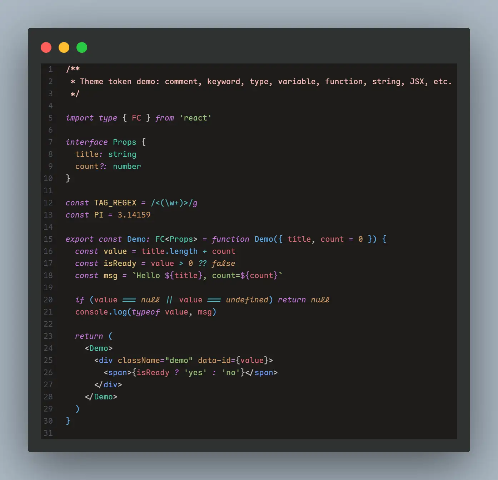

# Pretty Dark Theme

## 说明

- **基底**: 基于 One Dark Pro 深度美化，更暗、更高对比度
- **语义配色**: 围绕「类型绿 / 变量红 / 常量黄 / 关键字紫斜体」做跨语言统一

## 主题设计

- **整体风格**
  - **编辑器背景**: `#191815d6`
  - **工作区前景（文字）**: `#c2c2c2`
  - **行高亮背景**: `#23262ced`
  - **选区背景**: `#67769660`
  - **当前行号颜色**: `#c2c2c2`
  - **普通行号颜色**: `#495162`

- **标签页 / 导航**
  - **活动标签背景**: `#193d4c`
  - **活动标签前景**: `#c2c2c2`
  - **非活动标签背景**: `#181818`
  - **非活动标签前景**: `#909090`
  - **侧边栏背景**: `#181818`
  - **侧边栏前景**: `#c2c2c2`

- **语法配色（语义规则）**
  - **关键字（if / for / public / class 等）**: 紫色 `#c678dd`，**全部斜体**
  - **类型 / 类 / 接口（含 Go / Java / C# 内置类型）**: 类型绿 `#4ec9b0`，不斜体
  - **变量（局部变量 / 参数 / 普通字段使用）**: 变量红 `#e06c75`
  - **结构体 / 对象字段（TS/TSX/Go/Rust 等）**: 属性黄橙 `#d19a66`
  - **常量 / 枚举 / 只读变量**: 常量黄 `#e5c07b`
  - **字符串**: 字符串绿 `#98c379`
  - **数字 / 通用常量**: 暖黄橙 `#d19a66`
  - **逻辑 / 算术 / 位运算符**: 青色 `#56b6c2`
  - **函数 / 方法名**: 函数蓝 `#61afef`
  - **命名空间 / 模块 / 包名**: 黄色 `#e5c07b`，部分命名空间名为黄色斜体
  - **this / self / Rust self 等语言内置变量**: 黄色 `#e5c07b`
  - **注释**: 暗淡肤黄 `#ffc3bab7`，如果是不支持透明度的编辑器（Zed）使用 `#be938b` 替代

- **HTML / CSS / JSX / TSX**
- **标签名**: 浅蓝 `#7d99db`（在 TSX 纯文本上下文中为中性白 `#c2c2c2`）
- **属性名（className / style 等）**: 属性黄橙 `#d19a66`
- **尖括号 `< >`**: 中性灰 `#c2c2c2`
- **HTML 内嵌 `<script>` 中的变量**: 中性白 `#c2c2c2`（与纯文本一致）
- **CSS 属性名**: 中性白 `#c2c2c2`

- **Markdown**
  - **标题**: 红系 `#e06c75`
  - **有序 / 无序列表符号**: 浅蓝 `#6f9bff`
  - **引用块**: 中灰 `#696969`
  - **加粗**: 属性黄橙 `#d19a66`，加粗样式
  - **斜体**: 标签浅蓝 `#6f9bff`，斜体样式
  - **行内代码 / 代码块**: 字符串绿 `#98c379`
  - **链接文字 / URL**: 链接蓝 `#61afef`

- **Diff / Git**
  - *Diff 编辑器（并排 / 内联对比）*
    - **新增文本背景（词级高亮）**: `#85e73422`
    - **删除文本背景（词级高亮）**: `#ed344322`
    - **新增整行背景**: `#8cc26521`
    - **删除整行背景**: `#50101555`
    - **新增行左侧边栏**: `#233c0eca`
    - **删除行左侧边栏**: `#d8374523`
  - *编辑器装订线（未提交改动标记）*
    - **新增行标记**: `#109868`
    - **删除行标记**: `#9A353D`
    - **修改行标记**: `#948B60`
  - *小地图（Minimap）装订线*
    - **新增**: `#109868`
    - **删除**: `#9A353D`
    - **修改**: `#948B60`
  - *资源管理器 Git 装饰*
    - **忽略文件前景**: `#636b78`
  - *语法（diff 文件内容高亮）*
    - **新增 / 删除 / 变更行、文件头**: 复用语法配色，详见 `markup.inserted/deleted/changed.diff` 与 `meta.diff.header.*`

- **终端**
  - **终端背景**: `#181714`
  - **终端前景**: `#c2c2c2`
  - **ANSI 基础颜色**: 基于 One Dark 系列重新调优，例如:
    - **蓝**: `#4aa5f0`
    - **青**: `#42b3c2`
    - **绿**: `#8cc265`
    - **红**: `#e05561`
    - **黄**: `#d18f52`

## 插件市场安装

- **搜索 ID**: `cjl.pretty-dark-theme`
